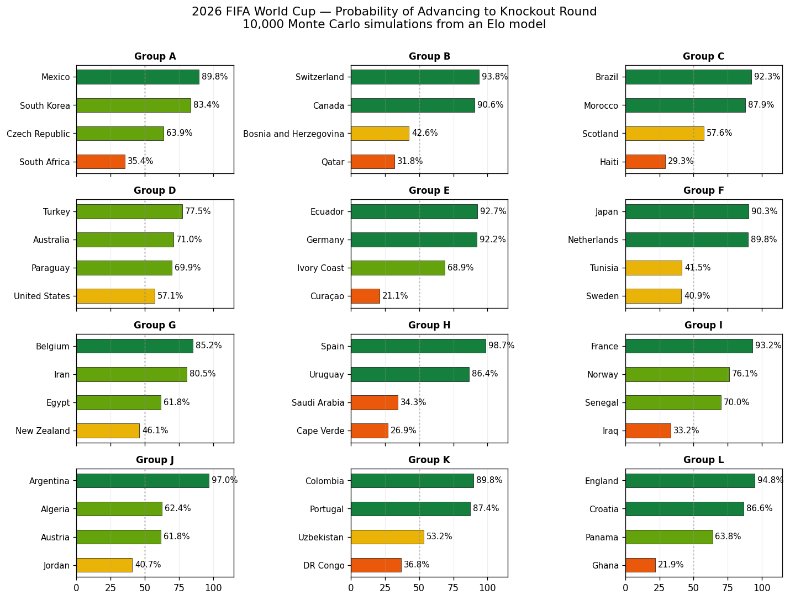
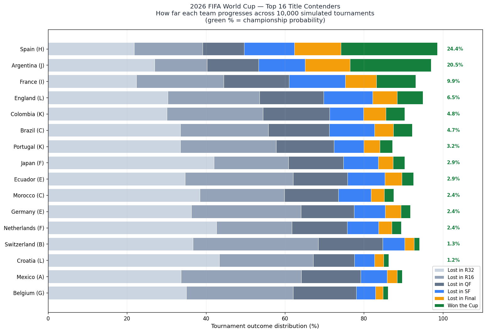

# 2026 FIFA World Cup — Market Efficiency Analysis

An end-to-end data science project that pits a probabilistic football model against the live betting market during the 2026 FIFA World Cup. The goal is not to "beat the bookies"; it is to measure how efficient the market is, where it disagrees with a rigorous model, and how well-calibrated each side turns out to be by the end of the tournament.

The pipeline runs autonomously: scheduled jobs poll live betting odds throughout the tournament, while the model produces probabilities that can be evaluated against the same matches as they finish.

> **About this project.** Built by [Cem Acun](https://github.com/cem-acun) as a portfolio project during my Applied Data Science studies at Jade University of Applied Sciences, Germany. I work part-time at a betting shop to support my studies. The everyday exposure to how odds move and where bookmakers misprice their lines is what made me want to build this in the first place.

## Headline results

**Elo model backtest** (3,572 international matches, 2023–2026):

| Metric         | Model  | Baseline | Notes                                                |
| -------------- | ------ | -------- | ---------------------------------------------------- |
| Accuracy       | 60.5%  | 47.2%    | Baseline = always predict home win                   |
| Brier score    | 0.5155 | 0.6667   | Lower is better (uniform 1/3-each = 0.667)           |
| Log loss       | 0.8824 | 1.0986   | Lower is better (uniform 1/3-each = ln 3 ≈ 1.099)    |

Calibration is near-perfect on home wins, with a known and documented weakness on draws. Elo is a strength-comparison model and does not directly capture the tactical conditions that produce draws. See [data/processed/calibration.png](data/processed/calibration.png).

**Monte Carlo group-stage forecast** (10,000 simulated tournaments):



The model's clearest convictions: Spain (98.7%) and Argentina (97.0%) almost certainly advance from their groups. Group D is the most chaotic, with no team above 80%; even host USA sits at 57.1%. The most striking model–market disagreements are likely in Group E (Ecuador 92.7% vs Germany 92.2%, roughly tied) and Group F (Japan 90.3% vs Netherlands 89.8%): both groups where the bookmakers will almost certainly favour the European side.
**Full-tournament Monte Carlo forecast** (10,000 simulated tournaments with the official 2026 bracket):



The model has two clear title favourites: **Spain (24.4%)** and **Argentina (20.5%)**, who together account for nearly half of all simulated championships. The chasing pack — France (9.9%), England (6.5%), Colombia (4.8%), Brazil (4.7%) — sits well behind. Brazil's championship probability looks low by reputation but reflects what current Elo data actually says: their group-stage probability of advancing (92%) is strong, but they are placed in the same half of the bracket as Spain. The bracket effect matters: Spain's path to the semi-final passes through softer opposition than Argentina's, which is why despite a smaller Elo gap, Spain leads in title probability.

The simulation uses FIFA's official Round of 32 pairings and the 495 third-place placement combinations defined in Annex C of the tournament regulations.

## How it works

```
+----------------------------------------------------------+
|  External scheduler (cron-job.org)                       |
|  hourly, 20 of 24 hours -> the-odds-api.com              |
|  -> repository_dispatch -> appends to data/odds_log.csv  |
+----------------------------------------------------------+
            |
            v
+----------------------------------------------------------+
|  Elo model (src/, notebooks/)                            |
|  trained on 32,260 international matches (1990-2026)     |
|  tournament-weighted K-factor + home-advantage           |
+----------------------------------------------------------+
            |
            v
+----------------------------------------------------------+
|  Monte Carlo tournament simulator                        |
|  10,000 runs -> per-team advancement / progression probs |
+----------------------------------------------------------+
            |
            v
+----------------------------------------------------------+
|  Evaluation: model vs. market vs. actual outcomes        |
|  Brier - log loss - calibration - vig-adjusted edge      |
+----------------------------------------------------------+
```

## Repo layout

```
worldcup2026-market-efficiency/
├── .github/workflows/collect-odds.yml   # scheduled + dispatch-triggered odds collector
├── collect_odds.py                      # the script the workflow runs
├── src/
│   └── groups.py                        # 2026 World Cup group draw
├── notebooks/
│   ├── 01_explore_data.ipynb            # data exploration + Elo training
│   ├── 02_backtest.ipynb                # leakage-free backtest + calibration
│   └── 03_monte_carlo.ipynb             # tournament simulation
└── data/
    ├── raw/                             # source CSVs (not modified)
    ├── processed/                       # model outputs, plots, metrics
    └── odds_log.csv                     # live odds history (auto-updated)
```

## Methodology notes

- **No look-ahead leakage.** Each match in the backtest is scored against the Elo rating *as it stood the day before the match*, not the post-tournament rating. This is why the processed matches file carries `home_elo_before` / `away_elo_before` columns.
- **K-factor weights tournaments by importance.** A friendly moves Elo by about one third as much as a World Cup match, following the World Football Elo Ratings convention.
- **Home advantage is venue-aware**, applied only when the match is not at a neutral venue (which is most of the World Cup).
- **Reliable scheduling via an external trigger.** GitHub Actions scheduled workflows are silently dropped during top-of-hour load spikes — per GitHub's own documentation, and confirmed empirically: in 24 hours of observation the native cron fired only 2 of an expected 12 times, even after offsetting the schedule to :13 past the hour. The robust fix was to remove the native cron entirely and use an external dedicated scheduler (cron-job.org) that calls GitHub's repository_dispatch API hourly, on the top of the hour. The schedule is concentrated on the 20-hour window where North American kick-off times and European-evening trading activity occur (UTC 00–07 and 12–23, skipping the dead window of UTC 08–11). This stays well within the free-tier API budget (20 calls per day × 21 days in June ≈ 420 of 500 credits) while giving 6–10 odds snapshots per match in the critical six-hour window before kick-off.
- **Goal-difference multiplier in Elo updates.** Following the World Football Elo Ratings formula: 1-goal margins move ratings normally, 2-goal margins move them 1.5x, larger margins scale with `(11 + |gd|) / 8`. This makes decisive wins worth more without letting blowouts dominate.

## What's next

- **Knockout-bracket simulation** for full champion probabilities (Phase 2B).
- **Daily fixture results pull** from football-data.org once the group stage begins.
- **Calibration vs. market**: once about 15 matches have been played, compare both sides' Brier and log loss on the same fixtures.
- **Streamlit dashboard**: live "model vs. market" view for the knockout rounds.

## Reproducing

```bash
git clone https://github.com/cem-acun/worldcup2026-market-efficiency.git
cd worldcup2026-market-efficiency
python3 -m venv worldcup-env
source worldcup-env/bin/activate
pip install pandas numpy matplotlib jupyter requests
jupyter notebook notebooks/
```

Then open `01_explore_data.ipynb` and run top-to-bottom. The raw international results CSV in `data/raw/` is checked in, so the notebook is self-contained.

## Sources

### Data

- **Historical international results.** Jurisoo, M. (2026). *International football results from 1872 to 2026.* [github.com/martj42/international_results](https://github.com/martj42/international_results) (CC0). 49,450 matches, the single most important dataset in this project.
- **Live betting odds.** [the-odds-api.com](https://the-odds-api.com), free tier (500 credits / month), Europe region, 1X2 markets across approximately 13 bookmakers including Pinnacle and Betfair Exchange. All live odds data shown or stored in this repository is sourced from and belongs to the-odds-api.com; it is used here solely for non-commercial academic analysis under their published Terms of Service. No data is redistributed as a standalone product.
- **Match results during the tournament.** [football-data.org](https://www.football-data.org), free tier (added once the group stage begins).
- **Group draw and fixtures.** Official FIFA final draw (5 December 2025), cross-checked against ESPN and Yahoo Sports.

### Python libraries

- McKinney, W. (2010). *Data Structures for Statistical Computing in Python.* [pandas.pydata.org](https://pandas.pydata.org/)
- Harris, C. R. et al. (2020). *Array programming with NumPy.* Nature. [numpy.org](https://numpy.org/)
- Hunter, J. D. (2007). *Matplotlib: A 2D Graphics Environment.* [matplotlib.org](https://matplotlib.org/)
- Requests HTTP library. [requests.readthedocs.io](https://requests.readthedocs.io/)
- Project Jupyter. [jupyter.org](https://jupyter.org/)

### Methodology references

- Elo, A. E. (1978). *The Rating of Chessplayers, Past and Present.* The foundational source for the Elo system.
- World Football Elo Ratings methodology. [eloratings.net/about](https://www.eloratings.net/about) (tournament-weighted K-factor and goal-difference multiplier).

### Infrastructure

- [GitHub Actions](https://docs.github.com/en/actions) for the workflow.
- [cron-job.org](https://cron-job.org) as the primary external scheduler.

### AI assistance

This project was developed with the help of an AI assistant ([Claude](https://www.anthropic.com/claude), Anthropic) as a supporting tool. The AI was used for the following tasks:

- Sketching architecture and reasoning through trade-offs (API budget planning, scheduler reliability, evaluation methodology)
- Generating code scaffolding and boilerplate
- Code review and debugging
- Suggesting Elo formulations and helping interpret calibration plots
- Drafting documentation and comments

All generated content was independently reviewed, understood, and adapted by the author. The conceptual design, methodological decisions, implementation, validation, and the final analysis are my own. Full responsibility for the content of this project rests with the author.


## Author

**Cem Acun**
B.Eng. Applied Data Science (in progress), Jade University of Applied Sciences, Germany

[github.com/cem-acun](https://github.com/cem-acun)

## License

MIT.
